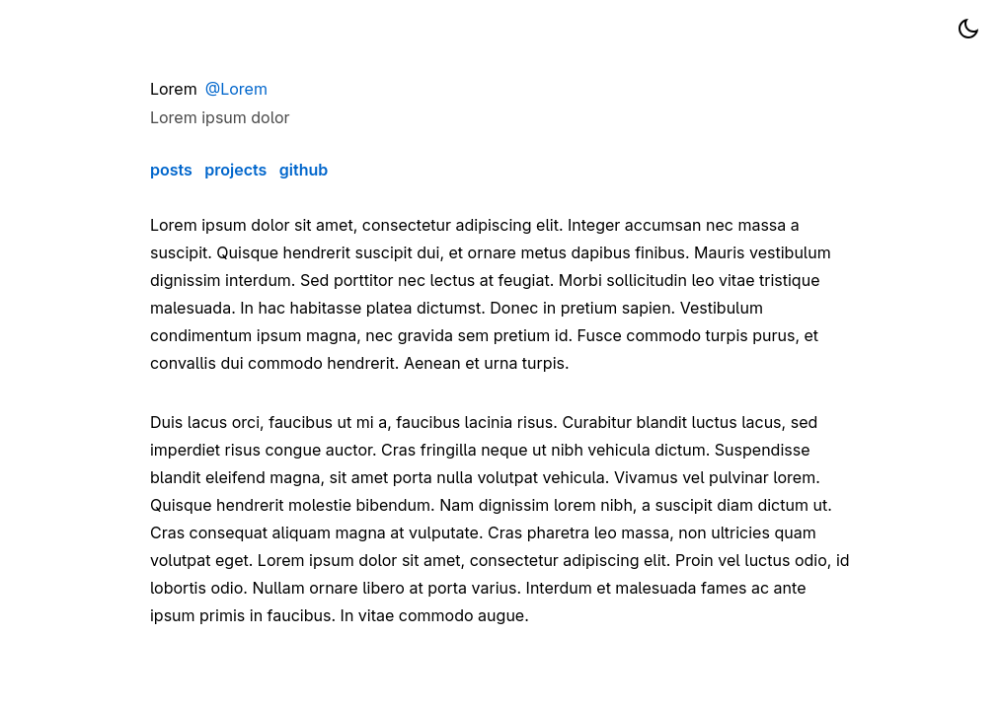
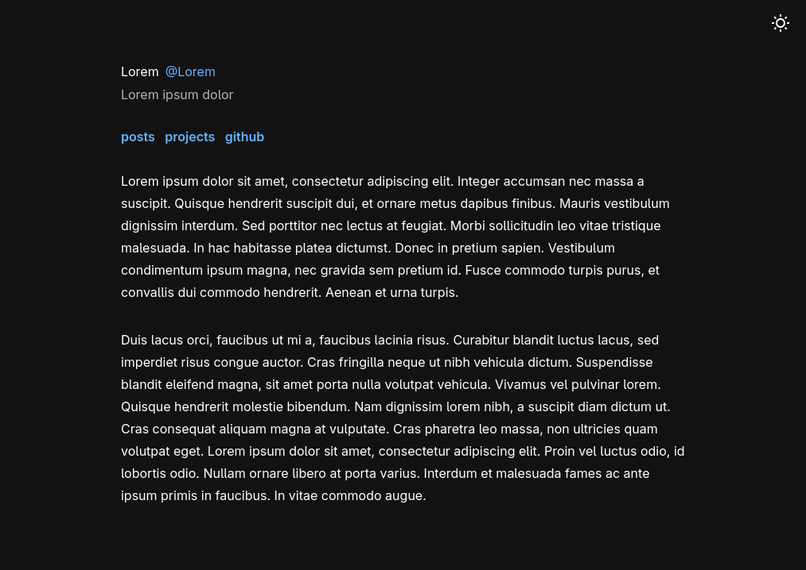

# Halcyon
A modern, feature-rich Zola theme that combines the performance foundation of [zola-hook](https://github.com/InputUsername/zola-hook) with the elegant layout design of [serene](https://github.com/isunjn/serene).

## Screenshots



## Key Features
- **GitHub Integration** - Live repository cards with stats, caching, and responsive design
- **Mathematical Expressions** - KaTeX support for beautiful math rendering  
- **Media Support** - YouTube embedding and responsive video containers
- **Code Enhancement** - One-click copying with visual feedback
- **Refined Design** - Improved accessibility, colors, and typography
- **High Performance** - 162 lines of JS, smart caching, progressive enhancement

## Quick Start
```bash
# Install Zola and create a new site
zola init my-blog && cd my-blog

# Add Halcyon theme
git clone https://github.com/m0ddr/halcyon themes/halcyon

# Configure in config.toml
theme = "halcyon"
```

## Documentation
- **[Usage Guide](USAGE.md)** - Detailed configuration and content creation

## Theme Stats
- **Total Lines:** 908 (908 core theme code)
- **Bundle Size:** CSS 6.1KB, JS 5.6KB - Lightweight and optimized
- **Performance:** Excellent Lighthouse scores, 55ms build time
- **Accessibility:** WCAG 2.1 compliant

## Contributing
Contributions welcome! Please submit issues and pull requests.

## License
MIT License - see [LICENSE](LICENSE) for details.

## Acknowledgments
Built upon [zola-hook](https://github.com/InputUsername/zola-hook) by InputUsername for performance and foundation, with layout design inspired by [serene](https://github.com/isunjn/serene) by isunjn. Enhanced for modern web development needs while preserving clean, minimalist aesthetics.
