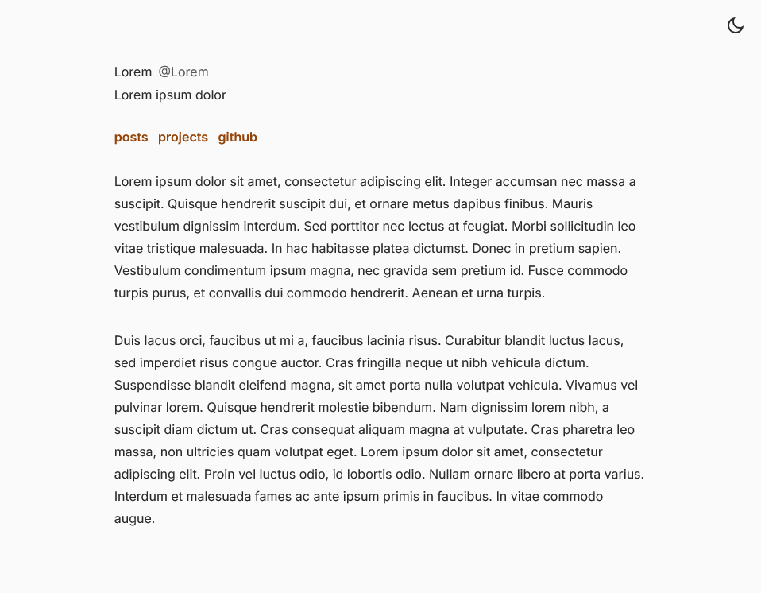
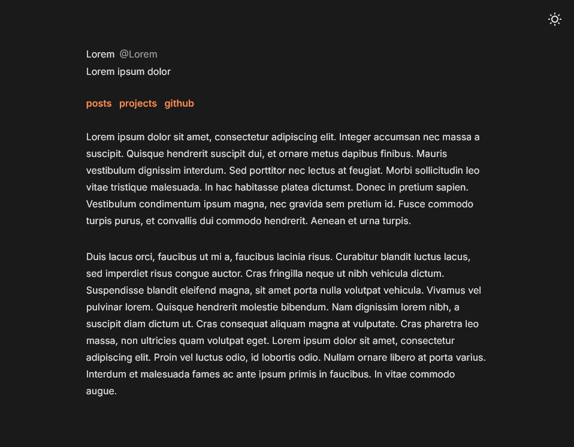

# Halcyon

A minimal Zola theme built on [zola-hook](https://github.com/InputUsername/zola-hook) with layout design from [serene](https://github.com/isunjn/serene).

## Screenshots



## Features
- GitHub repository cards with live stats
- KaTeX math rendering
- Code block copy buttons
- Light and dark themes
- Responsive design

## Installation
```bash
# Create a new Zola site
zola init my-blog && cd my-blog

# Add the theme
git clone https://github.com/m0ddr/halcyon themes/halcyon

# Configure in config.toml
theme = "halcyon"
```

## License
MIT License - see [LICENSE](LICENSE) for details.

## Credits
Based on [zola-hook](https://github.com/InputUsername/zola-hook) by InputUsername and [serene](https://github.com/isunjn/serene) by isunjn.
